# 明确一件事情：      

# 每个顶点执行vert

# 每个片元执行frag

# 1、GL接口

## 使用屏幕坐标 {[0,1],[0,1]} 绘图

- GL.LoadOrtho()：设置ortho perspective，即水平视角。GL.Vertex3()取值范围从左下角的(0,0,0)到右上角的(1,1,0）即需要除上Screen.width和Screen.heigh

- _raymarchMaterial.SetPass(0); 

  设置一个材质的渲染通道（pass），使得后续的渲染操作会使用这个材质的第一个渲染通道

  确保了指定的材质（`_raymarchMaterial`）的第一个渲染通道（pass）被激活，这样 Shader 程序才能生效并开始渲染。

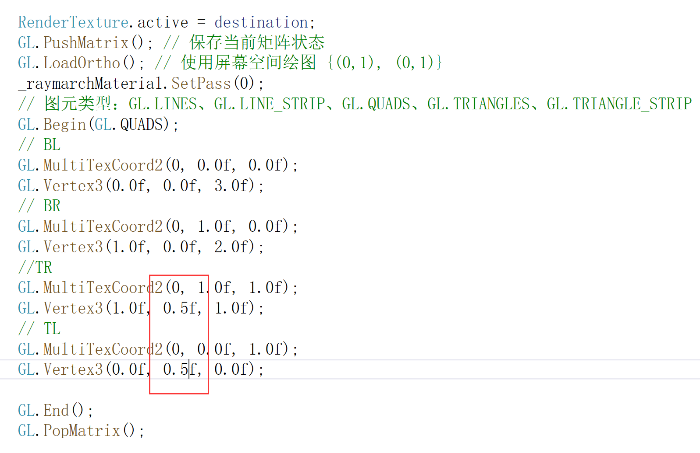

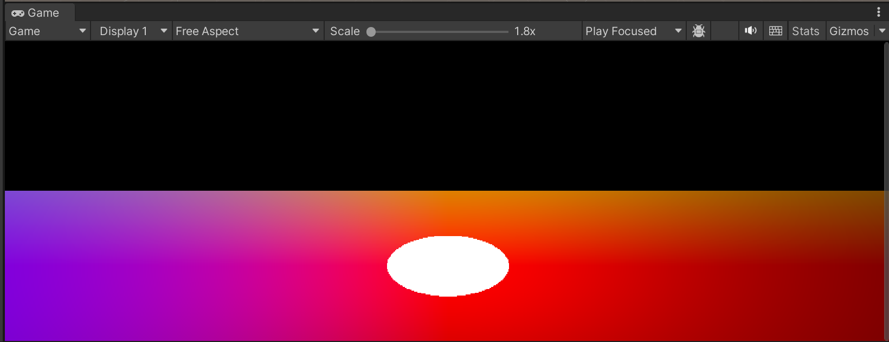

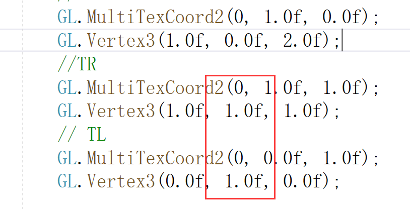

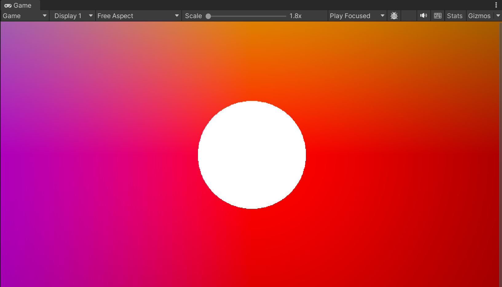

# 2、屏幕空间

unity相机空间的z轴与gameObject的z轴是相反的，相机空间下相机看向-z方向

- gameobject下的z轴（蓝色）

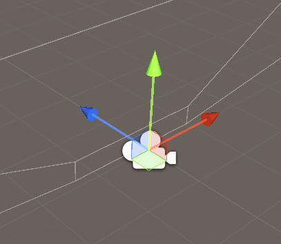

# 3、梯度近似法线

```c
float3 getNormal(float3 p)
{
    const float2 offset = float2(0.001, 0.0);
    // 梯度近似法线
    float3 n = float3(
        distanceField(p + offset.xyy) - distanceField(p - offset.xyy),
        distanceField(p + offset.yxy) - distanceField(p - offset.yxy),
        distanceField(p + offset.yyx) - distanceField(p - offset.yyx)
    );
    return normalize(n);
}
```

# 4、深度纹理

从以下例子可以看出深度LinearEyeDepth求出的深度越远深度越大

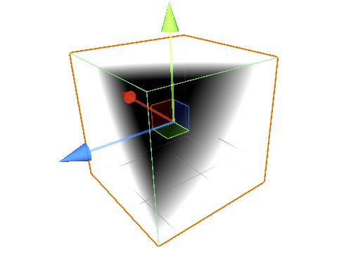

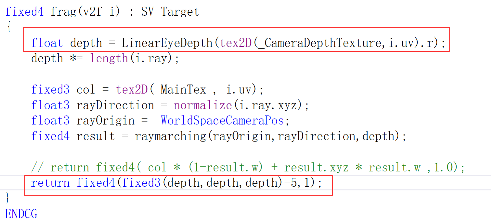

## 使用深度纹理获得深度，保证在求交过程中图像重叠的正确性

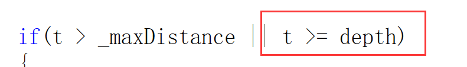

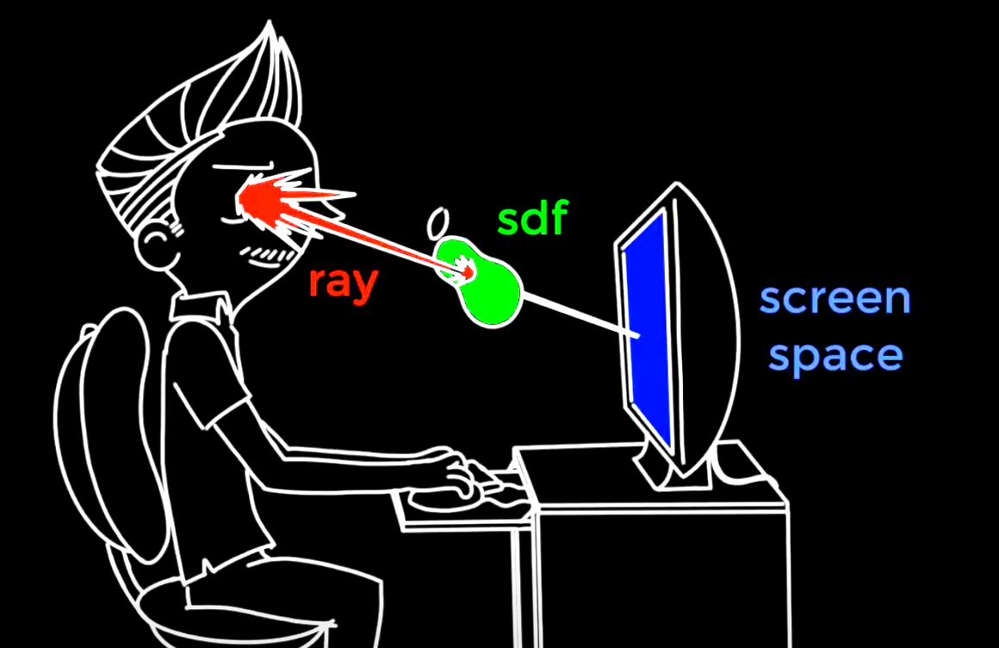

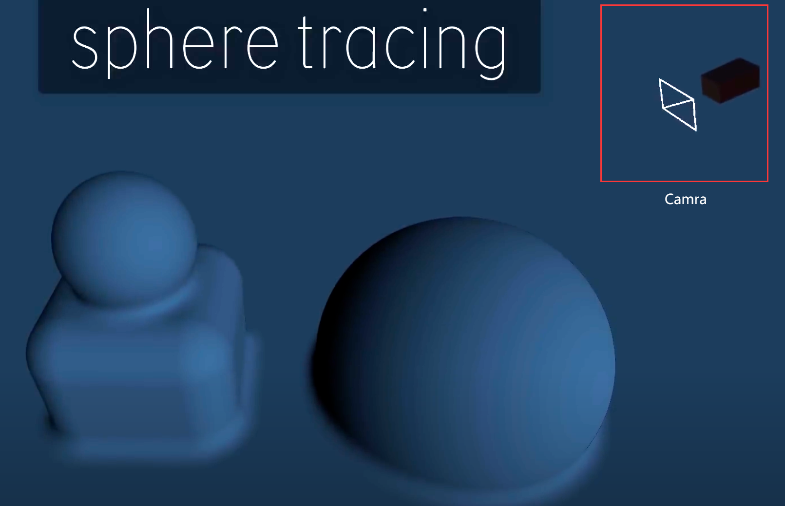

# 5、OnRenderImage

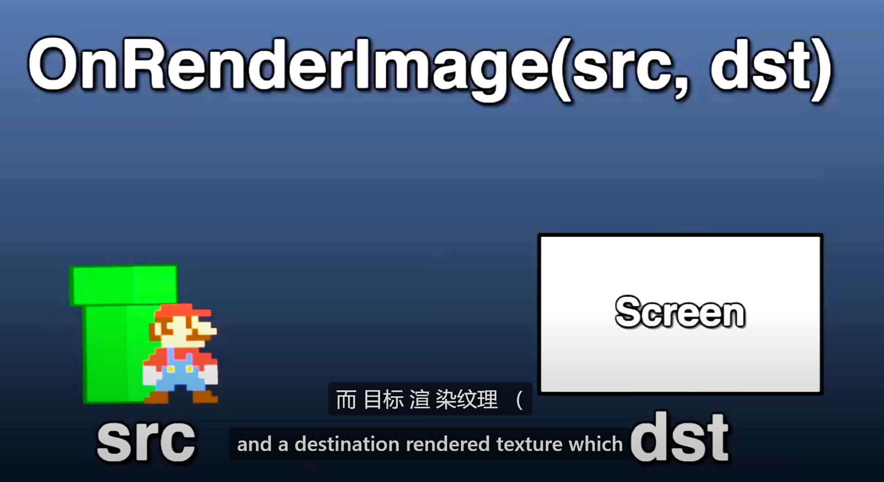

# 6、Ambient Occlusion（环境光遮蔽）

# 总结

- ## 屏幕相当于相机视锥的近平面，因为在光栅化的时候，所有的物体是被投影到近平面上的

- ## 在逆光栅化的时候，我们的相机位置就在-z的方向上


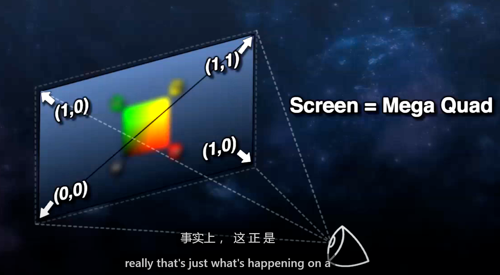

